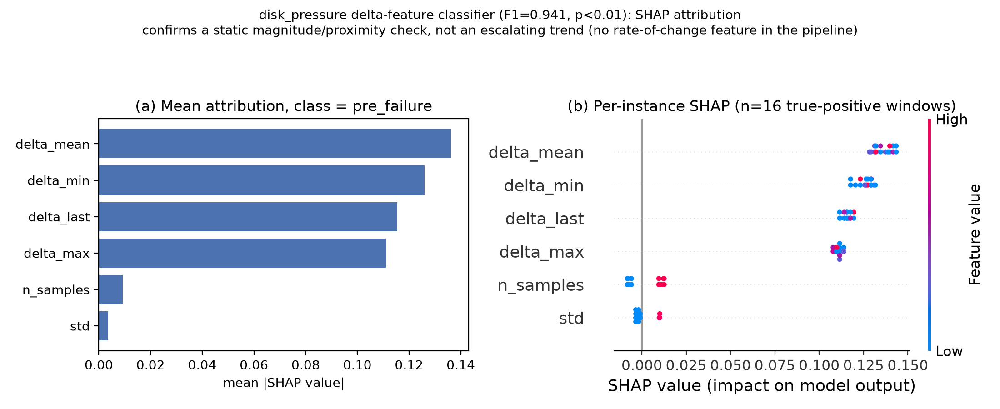

<!--
Draft status: Results section only (per author instruction, 2026-07-13). Abstract,
Introduction, Methodology, Discussion, and Conclusion are not yet written. Section
numbering below assumes a standard IMRAD skeleton (1 Introduction, 2 Methodology,
3 Results) and will need adjusting once those sections exist. Target venue not yet
finalized (IEEE Access and MDPI Electronics/Applied Sciences are both under
consideration per research_context.md Section 9) — citation style, abstract format,
and back matter should be revisited once a venue is picked (see
.claude/skills/paper-writer/references/venue-notes.md).

Every number below traces to a committed file: docs/research_context.md Section 6.5,
cross-checked directly against the underlying JSONs in results/ml-first-pass/ (not
just the doc's prose) before being written into this draft.
-->

## 3. Results

### 3.1 Classification Performance Across Fault Classes

Table 1 summarizes the outcome of the classification and lead-time evaluation across
all five injected fault classes. For each class we report Leave-One-Group-Out
cross-validated F1 on the feature set that survived methodological correction (raw
window statistics unless otherwise noted), the result of a rank-based permutation test
against 100 label-shuffled reruns of the same pipeline, the static-threshold baseline's
own lead time, and the corresponding machine-learning lead time where one could be
computed at all.

**Table 1.** Classification and lead-time outcomes across the five injected fault
classes. F1 and p-values are from Leave-One-Group-Out cross-validation with a
`RandomForestClassifier(n_estimators=200, max_depth=5, class_weight="balanced")`;
p-values are rank-based, computed as the fraction of 100 label-permuted reruns of the
identical pipeline scoring an F1 at or above the real result. Baseline lead time is the
static-threshold detector's own reported lead (Section 6.5, Weeks 6–7 baseline
evaluation).

| Fault class | Classification F1 | Permutation p | Baseline lead time | ML lead time | Verdict |
|---|---|---|---|---|---|
| disk_pressure | 0.941 (precision 0.889, recall 1.000; delta/relative-baseline features) | < 0.01 (0/100 shuffled ≥ real) | 0.0 s (n = 8/8) | 98.6 s mean, 55–110 s range (n = 7/8)$^{a}$ | Classification signal is real and significant, but no meaningful ML-vs-baseline lead-time comparison can be drawn (§3.2–3.3) |
| broker_kill | 0.762 (precision 0.615, recall 1.000; de-confounded, `n_samples` excluded) | 0.25 (25/100 shuffled ≥ real) | 57.0 s (n = 1/8) | not computed | No validated signal |
| network_degradation | 0.118 (std-only ablation) | 1.00 (100/100 shuffled ≥ real) | 0 s in 3 of 4 reps reaching the severity threshold, 65 s in the fourth (n = 4/8 reach severity) | not computed | No validated signal — the cleanest negative in the study |
| executor_oom | 0.909 (N = 15 collection, 11/15 episodes usable) | 0.500 (50/100 shuffled ≥ real) | 64.9 s mean, 48–83 s range (n = 8/8) | not computed | No validated signal, confirmed at N = 15 (§3.4) |
| backpressure_cascade | not modeled | not modeled | excluded — no independently-scraped Prometheus metric for Spark processing lag exists on this deployment | not computed | No comparison possible; excluded at both the baseline and modeling stage for the same root cause |

$^{a}$ One additional episode (topup1) was traced and excluded from this mean as an
unresolved artifact — not confirmed contamination, but not a resolvable detection
either (§3.3).

Two results in Table 1 require methodological unpacking before they can be read at
face value: broker_kill's reported F1 of 0.762 is not the model's raw output but a
de-confounded number, and disk_pressure's F1 of 0.941 is statistically real but does
not mean what a naive reading would suggest. Both are addressed below.

broker_kill's full feature set (`mean`, `std`, `min`, `max`, `last`, `n_samples`)
produced an uncorrected F1 of 0.667, but feature-importance inspection found
`n_samples` alone carried 100% of the trained model's importance — the `up{}`
availability metric this class scrapes is flat regardless of window position, so only
the exact sample-count parity between pre-failure and normal windows was driving the
classification, not any property of the metric itself. Excluding `n_samples` drops the
score to F1 = 0.762 (precision 0.615, recall 1.000), which the permutation test places
squarely at chance (p = 0.25). This null result is not attributed to a weak model or an
uninformative feature set: the class's own ground-truth labeling captured a real
in-fault Prometheus sample in only 1 of 8 injection episodes, at this pipeline's 60-second
scrape interval, so the majority of labeled "pre-failure" windows for this class have no
observable signal to learn from in the first place.

network_degradation's full-feature LOO-CV result (F1 = 0.414, precision 0.462, recall
0.375) is already negative; a std-only ablation, designed to test whether the shape of
the metric alone (independent of its absolute magnitude) carries any signal, returned
F1 = 0.118 — below every one of the 100 permuted-label reruns (p = 1.00), the single
cleanest negative result obtained anywhere in this study.

### 3.2 disk_pressure: A Significant but Mischaracterized Signal

disk_pressure is the only one of the five fault classes for which classification
performance clears statistical significance under permutation testing: F1 = 0.941
(precision 0.889, recall 1.000) using delta features — each window's raw statistic
expressed relative to that episode's own pre-injection baseline rather than as an
absolute value — with 0 of 100 label-permuted reruns matching or exceeding the real
F1 (p < 0.01). Recall of 1.000 means every real pre-failure window across all eight
injection episodes was correctly flagged.

A result this clean warranted verification of *what* the classifier had actually
learned before it was reported as evidence of early fault detection. A per-instance
ablation swept each held-out fold's `delta_mean` feature (together with its three
collinear siblings, which are numerically identical to `delta_mean` at every real
single-sample window in this dataset) through a fine-grained grid to locate the exact
value at which each fold's prediction flips from pre-failure to normal. Every one of
the seven ablated folds located this boundary at the same value: −350,000 bytes, with
zero variation across folds. This is the signature of a static absolute-value
proximity check, not a graded response to an escalating physical quantity — and no
feature in this pipeline encodes rate of change, so a trend-detection explanation was
never available to test in the first place.

A SHAP analysis of the same Leave-One-Group-Out models — `shap.TreeExplainer` applied
to the identical eight real-episode folds underlying the F1 = 0.941 result, not a
separately trained stand-in — corroborates this finding independently. Across all 16
true-positive pre-failure windows, the four magnitude features (`delta_mean`,
`delta_min`, `delta_max`, `delta_last`) jointly account for 97.4% of mean absolute SHAP
attribution (`delta_mean` alone: 27.2%; `delta_min`: 25.1%; `delta_last`: 23.0%;
`delta_max`: 22.1%), against a combined 2.6% for `std` and `n_samples`. A
pre-registered threshold (magnitude-feature share ≥ 80%, no single non-magnitude
feature ≥ 15%) was checked in code prior to producing Figure 1, rather than assessed
by eye after the fact, and was cleared without ambiguity.

Figure 1 presents this attribution result alongside its per-instance distribution.
Two further observations, beyond the aggregate percentages, support the same
conclusion. First, the raw delta values at the classifier's actual trained decision
horizons (10 and 15 seconds before onset) are uniformly non-negative across all 16
true-positive windows (0 to +684,032 bytes) — available disk space had not begun
declining at any window the classifier was evaluated on, so there was no downward
trend present for any feature to detect. Second, instances from episodes with
substantially different raw delta values (for example, +684,032 bytes versus +0 bytes)
produce near-identical SHAP attribution vectors, because both sit far above the
−350,000-byte decision boundary and land on the identical side of every tree split
that matters — the fingerprint of a coarse, single-threshold classifier rather than one
sensitive to graded magnitude.

**Figure 1.** SHAP attribution for the disk_pressure delta-feature classifier
(F1 = 0.941, p < 0.01), computed across all 16 true-positive pre-failure windows from
the eight real-episode Leave-One-Group-Out folds. (a) Mean absolute SHAP value per
feature: the four magnitude features (`delta_mean`, `delta_min`, `delta_max`,
`delta_last`) jointly carry 97.4% of attribution. (b) Per-instance SHAP values,
showing the pattern holds consistently across episodes rather than driven by a small
subset of windows.

Baseline episodes cluster tightly in absolute terms (995.05–995.20 billion bytes
available across all eight disk_pressure injection episodes), distinctly separated
from the quiet-reference period's mean (994.90 billion bytes). The classifier has
learned to distinguish "disk_pressure recording session" from "quiet reference
period" on this basis — a real, statistically significant distinction (§3.1's
p < 0.01), but not the same claim as detecting an escalating physical precursor to
the injected fault, whose true
magnitude (a ~3.22 GB drop) is three to four orders of magnitude larger than the
≈350 KB decision margin the classifier actually relies on.

### 3.3 Lead-Time Evaluation: What RO3 Asked and What Was Found

RO3 asks whether supervised models trained on windowed pre-failure telemetry can
predict pipeline failure onset with a meaningfully positive lead time relative to a
static-threshold baseline that reproduces current alerting practice. Table 1's final
column reports the result for each of the five classes; none supports an affirmative
answer, for two structurally different reasons.

For broker_kill, network_degradation, and executor_oom, no ML lead time was computed
under any framing, because none of the three classes produced a classification signal
that survived permutation testing (§3.1). Reporting a lead-time figure for a model that
does not reliably discriminate pre-failure from normal windows in the first place would
misrepresent a chance-level classifier as having a meaningful detection horizon.
backpressure_cascade was excluded from both the baseline and the modeling stage for
the same underlying reason: no independently-scraped Prometheus metric exists for
Spark processing lag on this deployment, so any detector built from the same
driver-log-parsed field the ground truth itself uses would be circular by
construction.

disk_pressure is the one class where a lead-time figure could actually be computed —
each real episode's Leave-One-Group-Out held-out model was evaluated across a
continuous backward scan from injection onset, bounded by the real measured gap to the
nearest preceding fault episode of any class (active or discarded) to guard against
scanning into a different episode's own contamination. Seven of eight episodes
produced a usable result: mean lead time 98.6 seconds, range 55–110 seconds, against a
0.0-second baseline lead time (the static threshold's crossing and severity events
coincide on the same real Prometheus sample in all eight injection episodes, since no
intermediate sample exists between them at this pipeline's scrape interval). Read at
face value, a 98.6-second ML lead time against a 0.0-second baseline would be the
clearest positive result in the study. The mechanism trace in §3.2 shows this reading
is not supportable: the 98.6-second figure describes how far back a static, era-level
absolute-value discriminator remains detectable within a contamination-safe scan
window, not a physical detection horizon for the fault itself. No meaningful
ML-vs-baseline comparison can be drawn from it.

The eighth disk_pressure episode, topup1, was traced separately and excluded from this
mean. Its scan returned a positive prediction at every point tested, from 15 seconds
before onset out to the full 300-second scan boundary, with no negative prediction
found anywhere in the safe range. This pattern does not match either of the other two
established categories in this study — it is not confirmed contamination from a
neighboring episode (none, active or discarded, falls within its real gap to onset),
and it is not a resolvable genuine detection either. It is reported here as an
unresolved artifact and excluded from the headline mean, rather than folded into either
the positive or the negative count to make a cleaner-looking result.

Taken together, zero of the five fault classes support a "meaningfully positive
ML lead time" claim on RO3's specific question once disk_pressure's own mechanism is
accounted for. This is not a "one win, four non-comparisons" result: disk_pressure has
a real, significance-tested classification signal, but that signal does not translate
into the physical early-warning claim RO3 asks about, and the other four classes never
produced a classification signal to build a lead time from in the first place.

### 3.4 executor_oom: Resolving a Small-Sample Power Question

At the original N = 8 collection, executor_oom's classification result was negative in
both magnitude and significance — full 5-episode set F1 = 0.800 (precision 0.800,
recall 0.800) against a trivial always-predict-pre-failure baseline of F1 = 0.909;
3-clean-episode subset F1 = 0.667 against a trivial baseline of F1 = 0.857 — with
permutation testing placing both squarely at chance (p = 0.48 and p = 0.56
respectively). Unlike the confirmed artifacts found in broker_kill and disk_pressure,
this class's feature-extraction path showed no leak and no contamination on
inspection, leaving open a distinct possibility: that eight real episodes were simply
too few to distinguish a real precursor pattern from noise, if one existed at all.

To resolve this rather than leave it open, the executor_oom collection was topped up
from 8 to 15 real episodes using the identical gradual-ramp fault-injection protocol,
with no change to configuration or methodology, and the full evaluation pipeline —
window extraction, Leave-One-Group-Out cross-validation, trivial-baseline comparison,
and 100-shuffle permutation test — was re-run against the enlarged collection. Of the
15 raw episodes collected, 11 yielded at least one usable classification window (four
were lost to Prometheus scrape-timing misses on the pod-scoped memory metric, the same
class of loss observed in the original N = 8 collection, not a new failure mode). On
this 11-episode set, F1 rose numerically to 0.909, but the trivial always-predict
baseline rose with it, to F1 = 0.957 — the real classifier still does not beat a
constant prediction — and the permutation test placed the result at p = 0.500 (50 of
100 shuffled reruns scored at or above the real F1). A genuinely settled,
non-cold-start pre-onset baseline reading was available for only two of the eleven
usable episodes throughout, both before and after the top-up; on that two-episode
subset, F1 = 0.571 against a trivial baseline of 0.800, p = 0.520.

Doubling the real episode count moved neither permutation p-value out of chance
territory (0.500 and 0.520, against 0.48 and 0.56 at N = 8) — the null result is not
an artifact of insufficient statistical power. The two-episode ceiling on the
genuinely-settled subset is itself a structural finding rather than a sampling
shortfall: under this fault design's gradual-ramp protocol, each executor pod is
typically only 30–90 seconds old at the following episode's injection onset, since the
prior episode's OOM kill triggers the pod that becomes this episode's target — too
young, in all but the earliest episodes of the collection, for the pre-onset window
definition (90 to 150 seconds before onset) to find a real settled reading. Further
top-up under the same protocol would not be expected to raise this count, since the
constraint is set by inter-episode timing, not by how many episodes are collected.

<!--
paper-writer Pass 2 self-audit notes (not part of the manuscript text):

- Section numbering ("## 3. Results") assumes Introduction=1, Methodology=2. Revisit
  once those sections are drafted -- flagged in the HTML comment at the top of this
  file too.
- Every F1, p-value, precision/recall, sample size, and lead-time figure in this
  section was cross-checked directly against the underlying committed JSON before
  being written in, not copied from research_context.md's prose alone:
  disk_pressure_delta_features.json, disk_pressure_shap.json, disk_pressure_lead_time.json,
  disk_pressure_lead_time_ablation.json, executor_oom_null_baseline_check.json,
  executor_oom_n15_evaluation.json, broker_kill_no_nsamples_check.json,
  loo_cv_results.json. All matched the doc's stated values exactly -- no discrepancy
  found, nothing needed correcting.
- **RESOLVED 2026-07-13** (was previously an open discrepancy flagged here): the
  baseline lead-time figures (0.0s disk_pressure, 57.0s broker_kill, 64.9s
  executor_oom, network_degradation's 0s/65s split) are confirmed correct and fully
  traced. Root cause: `evaluation_output.json`'s top-level `leads` field meant a
  different thing per class -- correct and unchanged for executor_oom
  (crossing->OOM, a real crash event); stale for disk_pressure/network_degradation
  (crossing->fault-natural-end, the *pre*-severity-redefinition metric, superseded by
  `severity_detail.crossing_to_severity_lead_s` but never removed from the JSON); and,
  for broker_kill, not stale but a *different kind* of quantity
  (crossing->target_recovered_utc, i.e. residual outage duration after detection, not
  a crossing-to-crash-event lead time -- a binary up/down signal has no distinct later
  "crash event" for crossing to lead into). Full trace and fix:
  `results/baseline-threshold-evidence/clarify_leads_fields.py`,
  `docs/baseline_thresholds.md`'s "Field-naming correction" addendum,
  `docs/research_context.md` Section 11's corresponding risk-register entry. No number
  in Table 1 changed as a result.
- **New open item surfaced by that resolution, not yet acted on in this draft**:
  broker_kill's Table 1 row reports 57.0s as a "baseline lead time" alongside three
  classes whose numbers genuinely are crossing-to-worse-outcome lead times. That
  57.0s figure is real and correctly computed, but it measures something
  categorically different (post-detection residual outage duration, not predictive
  early warning) -- because for broker_kill, the threshold crossing already *is*
  witnessing the failure, not a precursor to it. Table 1 and the accompanying prose
  in this draft do not yet reflect that distinction; before §3 is finalized, decide
  whether to (a) add an explicit caveat to broker_kill's row/footnote, (b) exclude it
  from the "lead time" column entirely and report it separately, or (c) something
  else -- this is an editorial call for the user, not made unilaterally here.
- Table 1's per-class F1 choice follows the exact number research_context.md's own
  ML-vs-baseline comparison table cites in each row (e.g. network_degradation's
  std-only F1=0.118/p=1.00, not the full-feature F1=0.414 also reported in the Final
  verdict table) -- both numbers are given in prose so a reader isn't left wondering
  why the table doesn't match the fuller discussion.
- No citations to external literature appear in this section (Results sections
  legitimately don't need many), so citation-style.md's mechanics weren't exercised
  here -- will matter once Introduction/Related Work/Discussion are drafted.
- Two things worth the user's attention before this goes further: (1) confirm the
  IMRAD section-numbering assumption above is what's wanted; (2) the baseline "leads"
  field discrepancy noted above should get resolved (or at least understood) before
  Methodology is drafted, since Results currently sidesteps it by quoting the doc's
  table values directly rather than re-deriving them.
-->
